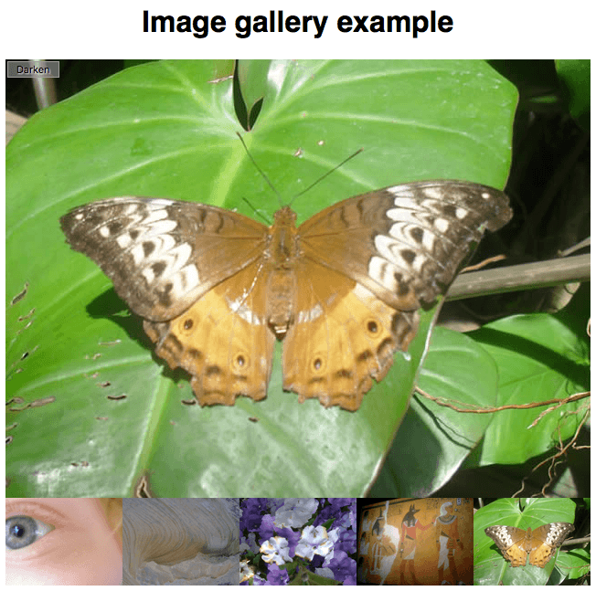

# Galerie de photos

## Résumé du projet

vous devez écrire le code JavaScript nécessaire pour en faire un programme fonctionnel. Le corps HTML ressemble à ceci:

```html
<h1>Image gallery example</h1>

<div class="full-img">
  
  <div class="overlay"></div>
  <button class="dark">Darken</button>
</div>

<div class="thumb-bar">

</div>
```

L'exemple ressemble à ceci:



Les parties les plus intéressantes du fichier CSS de l'exemple:

- Positionnez les trois éléments en absolu à l’intérieur du `full-img <div>`: le `` dans lequel l’image est affichée grandeur nature, un `<div>` vide dimensionné à la même taille que le `` et placé juste au-dessus (ceci est utilisé pour appliquer un effet assombrissant à l'image via une couleur d'arrière-plan semi-transparente), et un bouton `<button>` qui est utilisé pour contrôler l'effet d'assombrissement.
- Réglez la largeur des images à l'intérieur de `thumb-bar <div>` (appelées images miniatures) à 20% et faites un float à gauche pour qu'elles soient côte-à-côte sur une ligne.

Votre JavaScript doit:

- Itérer toutes les images dans une boucle, et pour chacune d'elle, insérer un élément `` à l'intérieur de `thumb-bar <div>` qui va incorporer cette image dans la page.
- Associer un gestionnaire d'événement `onclick` à chaque `` à l'intérieur de `thumb-bar <div>` pour que, lorsqu'elles sont cliquées, l'image correspondante soit affichée dans l'élément `displayed-img `.
- Associer un gestionnaire d'événement `onclick` au `<button>` pour que, lorsqu'il est cliqué, un effet assombrissant soit appliqué à l'image grandeur nature. Losrqu'il est cliqué à nouveau, l'effet doit disparaitre.

# Les différentes étapes

## Itération sur les images

Nous vous avons fourni des lignes qui storent une référence à `thumb-bar <div>` dans une variable nommée `thumbBar`, créent un nouvel élément ``, vous devez définir son attribut `src` et ajouter ce nouvel élément `` dans `thumbBar`.

<details>
  <summary>Instructions cachées</summary>
1. Ajouter votre code à l'intérieur d'une boucle qui itère sur les 5 images.
2. Il faut définir la valeur de l'attribut `src` dans chaque cas. Gardez à l'esprit que, à chaque fois, l'image est dans le répertoire des images et que son nom est `pic1.jpg`, `pic2.jpg`, etc.
</details>

## Ajout d'un gestionnaire onclick à chaque miniature

À chaque itération, vous devez ajouter un gestionnaire `onclick` au `newImage` courant. Il doit:


<details>
  <summary>Instructions cachées</summary>
1. Trouver la valeur de l'attribut `src` de l'image courante. Cela peut être fait avec la fonction [`getAttribute()`](/fr/docs/Web/API/Element/getAttribute) sur ``, en lui passant le paramètre `"src"` à chaque fois. Mais comment avoir l'image? Utiliser `newImage` ne marche pas du fait que la boucle est finie avant que le gestionnaire d'événement ne soit appelé; de cette manière, la valeur de `src` sera toujours celle du dernier ``. Pour résoudre cela, gardez à l'esprit que, pour chaque gestionnaire d'événement, c'est `` qui en est la cible. Pourquoi ne pas récupérer l'information de l'objet événement?
2. Exécuter une fonction, en lui passant en paramètre la fameuse valeur de `src`. 
3. Cette fonction du gestionnaire d'événement doit définir la valeur de l'attribut `src` de `displayed-img ` à la valeur du `src` passé en paramètre. Nous vous avons fourni une ligne qui stocke une référence de l'`` concerné dans une variable nommée `displayedImg`. Notez que nous voulons une fonction nommée.
</details>

## Écrire le gestionnaire du bouton d'assombrissement

Il ne reste que notre `<button>` d'assombrissement — nous vous avons fourni une ligne qui stocke une référence au `<button>` dans une variable appelée `btn`. Vous devez ajouter un gestionnaire `onclick`.

<details>
  <summary>Instructions cachées</summary>

1. Vérifie la classe appliquée à `<button>` — à nouveau, vous pouvez utiliser `getAttribute()`.
2. Si le nom de classe est `"dark"`, changer la classe du `<button>` pour `"light"` (avec [`setAttribute()`](/fr/docs/Web/API/Element/setAttribute)), son contenu textuel par "Lighten", et le {{cssxref("background-color")}} du voile d'assombrissement `<div>` par `"rgba(0,0,0,0.5)"`.
3. Si le nom de classe n'est pas `"dark"`, changer la classe du `<button>` pour `"dark"`, son contenu textuel par "Darken", et le {{cssxref("background-color")}} du voile d'assombrissement `<div>` par `"rgba(0,0,0,0)"`.

</details>


## Conseil

- Vous n'avez pas besoin d'éditer le code HTML ni le code CSS.

